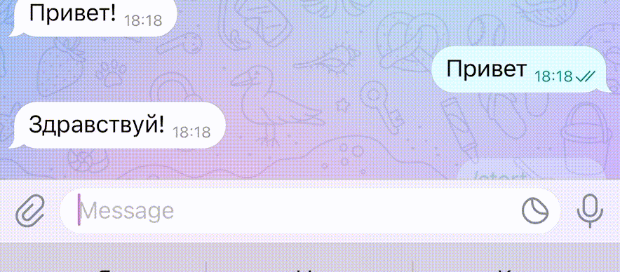
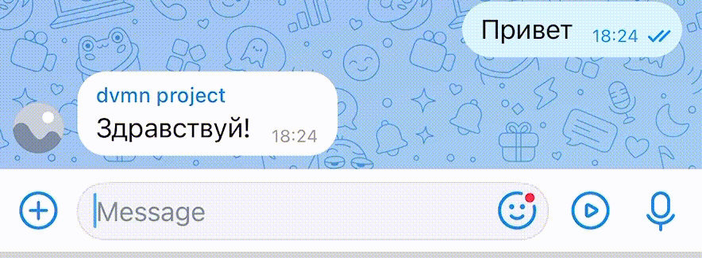

# Telegram и VK бот с Dialogflow

Этот проект содержит умных ботов для Telegram и ВКонтакте, подключённых к нейросети Dialogflow. Боты могут вести диалог на естественном языке и реагировать на пользовательские запросы.

---
## Что это

Проект включает двух ботов:

- **Telegram-бот** — обрабатывает команды, вольные фразы и ошибки, отправляя логи админу
- **VK-бот** — ведёт диалог с пользователями группы, молчит, если не понял, и не мешает операторам

Оба бота связаны с [Dialogflow](https://dialogflow.cloud.google.com/), чтобы:

- понимать запросы на естественном языке (NLP)
- отвечать не по ключевым словам, а по смыслу
- легко дообучаться без переписывания кода

---

## 📸 Примеры работы (GIF)

| Telegram бот | VK бот |
|--------------|--------|
|  |  |
| Платформа | Ссылка |
| Telegram | [@example_neuro_bot](https://t.me/verb_g_bot) |
| VK       | [Группа с ботом](https://m.vk.com/club231938497?from=groups) |

## Возможности

- Поддержка Telegram и ВКонтакте
- Интеграция с Dialogflow (Natural Language Understanding)
- Обработка интентов
- Игнорирование fallback-интентов (бот молчит, если не понял)
- Автоматическое обучение интентов из `questions.json`

---

## Установка

### 1. Клонируй проект и создай виртуальное окружение:

```bash
git clone https://github.com/gardnervile/tg_bot_neuro.git
cd tg_bot_neuro
python3 -m venv venv
source venv/bin/activate
```
### 2. Установи зависимости:

```
pip install -r requirements.txt
```
## Настрой переменные окружения

Создай файл `.env` и добавь в него:
```
# Токен Telegram-бота
TG_TOKEN=your_telegram_token_here

# Токен группы VK
VK_TOKEN=your_vk_token_here

# ID проекта Dialogflow
PROJECT_ID=your_project_id_here

# Путь к JSON-файлу с ключом сервисного аккаунта Google Cloud
GOOGLE_APPLICATION_CREDENTIALS=credentials.json
```

## Запуск

Telegram-бот:
```
python telegram_bot.py
```
VK-бот:
```
python vk_bot.py
```
## Обучение Dialogflow интентам

Запусти файл `questions.json`
```
python train_dialogflow.py
```
Новые интенты появятся в консоли Dialogflow.

## Требования

- Python 3.8–3.12
- Аккаунт Google Cloud с включённым Dialogflow API
- VK-группа с включённым Long Poll API
